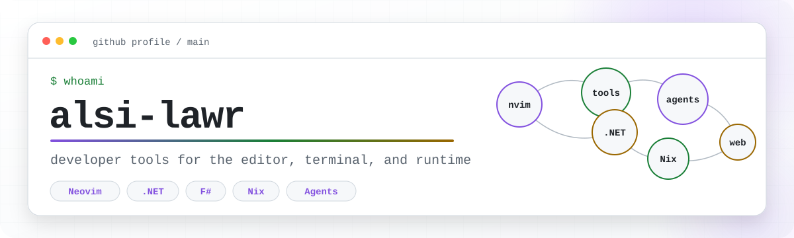

  <picture>
    <source media="(prefers-color-scheme: dark)" srcset="./assets/profile-header-dark.svg">
    <source media="(prefers-color-scheme: light)" srcset="./assets/profile-header-light.svg">
    
  </picture>

   

     

## Languages

  

## Selected work

<table>
  <tr>
    <td width="50%" valign="top">
      

        
      

      <h3><a href="https://github.com/alsi-lawr/termin.al">termin.al</a></h3>
      
A terminal-shaped portfolio for exploring projects, writing, activity, and more through a browser-based virtual shell.

      
<code>TypeScript</code> <code>F#</code> <code>browser shell</code>

    </td>
    <td width="50%" valign="top">
      

        
      

      <h3><a href="https://github.com/alsi-lawr/agent-term.nvim">agent-term.nvim</a></h3>
      
Persistent terminal coding-agent sessions inside Neovim, with flexible views, switching, and editor-context helpers.

      
<code>Lua</code> <code>Neovim</code> <code>coding agents</code>

    </td>
  </tr>
  <tr>
    <td width="50%" valign="top">
      

        
      

      <h3><a href="https://github.com/alsi-lawr/neotheme.nvim">neotheme.nvim</a></h3>
      
A semantic, palette-driven Neovim colorscheme with a visual browser, persistent palette editor, and reproducible previews.

      
<code>Lua</code> <code>Neovim</code> <code>design systems</code>

    </td>
    <td width="50%" valign="top">
      

        
      

      <h3><a href="https://github.com/getviset/Viset">Viset</a></h3>
      
Browser screenshots and animated WebP captures as code, with device and theme matrices, direct ownership, and reproducible execution.

      
<code>F#</code> <code>.NET</code> <code>capture tooling</code>

    </td>
  </tr>
  <tr>
    <td width="50%" valign="top">
      

        
      

      <h3><a href="https://github.com/alsi-lawr/HUMANS.md">HUMANS.md</a></h3>
      
Coding-agent contracts, governed Casefile workflows, and reusable engineering guidance as independently installable plugins.

      
<code>agents</code> <code>workflows</code> <code>governance</code>

    </td>
    <td width="50%" valign="top">
      

        
      

      <h3><a href="https://github.com/alsi-lawr/chatgpt-analysis">ChatGPT Export Analysis</a></h3>
      
A local-first pipeline that turns ChatGPT exports into a reproducible, queryable analysis corpus with evidence linked back to source turns.

      
<code>Python</code> <code>SQLite</code> <code>local-first</code>

    </td>
  </tr>
  <tr>
    <td width="50%" valign="top">
      

        
      

      <h3><a href="https://github.com/alsi-lawr/phrasic">Phrasic</a></h3>
      
A provider-neutral, browser-only now-playing display with responsive visuals, accessible motion, and explicit connection states.

      
<code>TypeScript</code> <code>browser</code> <code>Docker</code>

    </td>
    <td width="50%" valign="top">
      

        
      

      <h3><a href="https://github.com/alsi-lawr/BlokeBot">BlokeBot</a></h3>
      
A self-hosted Twitch bot and dashboard for commands, games, points, giveaways, and managing multiple channels.

      
<code>self-hosted</code> <code>Twitch</code> <code>Nix</code>

    </td>
  </tr>
  <tr>
    <td width="50%" valign="top">
      

        
      

      <h3><a href="https://github.com/alsi-lawr/alsi.caseconversions">ALSI.CaseConversions</a></h3>
      
Small, allocation-conscious .NET string case conversion for identifiers, keys, generated names, and application boundaries.

      
<code>C#</code> <code>NuGet</code> <code>performance</code>

    </td>
    <td width="50%" valign="top">
      

        
      

      <h3><a href="https://github.com/alsi-lawr/dotnet-workspace-explorer">dotnet-workspace-explorer</a></h3>
      
Language-agnostic .NET solution and project operations, with direct commands and a versioned MessagePack-RPC workspace endpoint.

      
<code>F#</code> <code>VB</code> <code>C#</code> <code>.NET tool</code>

    </td>
  </tr>
  <tr>
    <td width="50%" valign="top">
      

        
      

      <h3><a href="https://github.com/alsi-lawr/gruber-darker-vs">Gruber Darker VS</a></h3>
      
A native Visual Studio 2022 theme mapping the Gruber Darker palette across syntax, editor UI, tool windows, and shell chrome.

      
<code>Visual Studio</code> <code>VSIX</code> <code>theme tooling</code>

    </td>
    <td width="50%" valign="top">
      

        
      

      <h3><a href="https://github.com/alsi-lawr/deploy-nuget">deploy-nuget</a></h3>
      
A reusable GitHub Action for building, packing, and publishing NuGet packages through a consistent, configurable release path.

      
<code>GitHub Actions</code> <code>NuGet</code> <code>CI/CD</code>

    </td>
  </tr>
  <tr>
    <td width="50%" valign="top">
      

        
      

      <h3><a href="https://github.com/alsi-lawr/dotnet-test-coverlet">dotnet-test-coverlet</a></h3>
      
A reusable action that runs .NET tests and generates coverage with configurable exclusions, SDK versions, and a minimum threshold.

      
<code>GitHub Actions</code> <code>.NET</code> <code>coverage</code>

    </td>
    <td width="50%" valign="top">
      

        
      

      <h3><a href="https://github.com/alsi-lawr/package-release-workflows">Package Release Workflows</a></h3>
      
Reusable workflows for reproducible .NET release packaging and delivery across archives, registries, package managers, and container channels.

      
<code>GitHub Actions</code> <code>releases</code> <code>packages</code>

    </td>
  </tr>
</table>

## Working set

  
  
  
  
  
  
  
  
  

